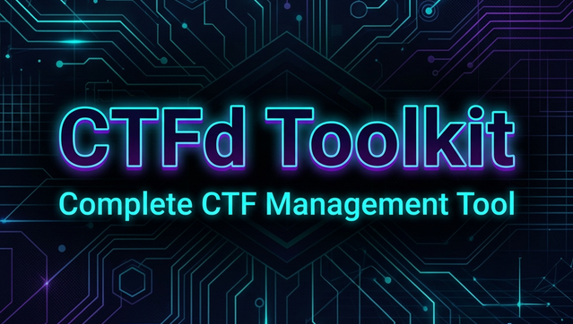

<div align="center">
  

  # CTFd Toolkit

  A comprehensive, terminal-based management tool for CTFd platforms with beautiful TUI, session caching, and multi-device notifications.

  [](https://www.python.org/)
  [](https://ctfd.io/)
  [](LICENSE)
</div>

---

## Features

- **🎨 Beautiful TUI Dashboard** - Color-coded progress view with centered title, grouped by category with solve counts and animated progress bars
- **📋 Smart Challenge Listing** - Filter by `--list`, `--unsolved`, or category with consistent formatting
- **📁 Bulk Download System** - Downloads all challenge files into organized `Category/Challenge/` folders, auto-generates per-challenge `README.md`, skips already-downloaded files with size verification (100MB limit)
- **🚩 Flag Submission** - Submits flags with automatic CSRF token handling; detects already-solved challenges with visual feedback
- **💾 Session Caching** - Saves login cookies for 24 hours (`~/.cache/ctfd_toolkit/`), secure `chmod 600` with automatic cache validation
- **🔔 Multi-Device Notifications** - Desktop alerts via `notify-send` and mobile via KDE Connect integration
- **🌍 Environment Variable Support** - `CTFD_URL`, `CTFD_USER`, `CTFD_PASS` for seamless workflow
- **📱 KDE Connect Integration** - Get flag submission notifications on your phone
- **🎯 Smart Terminal Detection** - Automatic terminal width detection with resize handling (SIGWINCH)
- **🔐 Browser-like Headers** - Realistic browser headers for better CTFd compatibility
- **⚡ Performance Optimized** - Efficient caching and minimal API calls
- **🎨 Colored Help Output** - Custom help formatter with colored short flags
- **🔄 Auto-Download Trigger** - Automatically downloads files when output directory specified

---

## 🚀 Installation

### Requirements
- Python 3.8+
- pip (Python package manager)
- `requests` library (see requirements.txt)
- `notify-send` for desktop notifications (optional)
- `kdeconnect` for mobile notifications (optional)

### Quick Install
```bash
# Clone the repository
git clone https://github.com/NoobGajen/CTFd-Toolkit.git
cd CTFd-Toolkit

# Install Python dependencies
pip3 install -r requirements.txt

# Make executable
chmod +x ctfd-toolkit.py
```

### Distribution-Specific Dependencies

#### 🐧 Debian/Ubuntu/Mint
```bash
sudo apt update
sudo apt install python3 python3-pip python3-requests libnotify-bin kdeconnect
```

#### 🐧 Arch Linux/Manjaro
```bash
sudo pacman -S python python-pip libnotify kdeconnect
```

#### 🐧 Fedora/CentOS/RHEL
```bash
sudo dnf install python3 python3-pip python3-requests libnotify kdeconnect
```

#### 🪟 Windows (WSL)
```bash
sudo apt update
sudo apt install python3 python3-pip python3-requests libnotify-bin
```

#### 🍎 macOS
```bash
brew install python3
# For notifications, install: brew install terminal-notifier
```

---

## Usage

### Basic Commands
```bash
# Status dashboard (default) - Beautiful centered title with progress bars
python3 ctfd-toolkit.py -u https://ctf.example.com -U username -P password

# Using environment variables (recommended)
export CTFD_URL="https://ctf.example.com"
export CTFD_USER="username" 
export CTFD_PASS="password"
python3 ctfd-toolkit.py

# List all challenges
python3 ctfd-toolkit.py --list

# List unsolved challenges only
python3 ctfd-toolkit.py --unsolved

# Filter by category
python3 ctfd-toolkit.py --list -c "Crypto"
python3 ctfd-toolkit.py --unsolved -c "Web"
```

### Advanced Features
```bash
# Download all challenge files (organized by category/challenge)
python3 ctfd-toolkit.py --download -o ./CTF_Files

# Download specific category only
python3 ctfd-toolkit.py --download -c "Pwn" -o ./Pwn_Challenges

# Auto-download when output directory specified
python3 ctfd-toolkit.py -o ./CTF_Files  # Automatically downloads

# Submit a flag with KDE Connect notifications
python3 ctfd-toolkit.py --submit -C "Challenge Name" -f "flag{...}" --kde-connect

# Quick flag submission (without --submit flag)
python3 ctfd-toolkit.py -C "Challenge Name" -f "flag{...}"

# Save status to JSON file
python3 ctfd-toolkit.py --status --save-status

# Verbose output for debugging
python3 ctfd-toolkit.py --verbose --status

# Disable notifications
python3 ctfd-toolkit.py --submit -C "Challenge" -f "flag{...}" --no-notify

# Clear cached session
python3 ctfd-toolkit.py --clear-cache
```

---

## Configuration

### Environment Variables
```bash
# Add to ~/.bashrc or ~/.zshrc for convenience
export CTFD_URL="https://ctf.example.com"
export CTFD_USER="your_username"
export CTFD_PASS="your_password"

# Reload shell
source ~/.bashrc  # or source ~/.zshrc
```

### KDE Connect Setup (Optional)
```bash
# Install KDE Connect on your system (see installation commands above)

# Pair your phone with KDE Connect
kdeconnect-cli --list-available

# Test notifications
python3 ctfd-toolkit.py --submit -C "Test" -f "test{flag}" --kde-connect
```

### Cache Management
```bash
# Cache location: ~/.cache/ctfd_toolkit/
# Cache duration: 24 hours
# Cache permissions: 600 (secure)

# Clear cache manually
python3 ctfd-toolkit.py --clear-cache

# Disable caching (login every time)
python3 ctfd-toolkit.py --no-cache --status
```

---

## Notification System

The toolkit supports multiple notification methods:

### Desktop Notifications (Default)
- **Correct flags**: Normal urgency (visible notification)
- **Incorrect flags**: Low urgency (silent/minimal)  
- **Already solved**: Normal urgency (visible)

### KDE Connect Mobile Notifications
```bash
# Enable mobile notifications
python3 ctfd-toolkit.py --submit -C "Challenge" -f "flag{...}" --kde-connect

# Disable all notifications
python3 ctfd-toolkit.py --no-notify --submit -C "Challenge" -f "flag{...}"
```

---

## Interface Preview

### Status Dashboard
```
╭──────────────────────────────────────────────────────────────────────╮
│                          ⚡ CTFd ToolKit ⚡                           │
╰──────────────────────────────────────────────────────────────────────╯

  ╭─ Binary Exploitation                                3/3  (100.0%)
  │  ✓ Hour of Joy                                         230 solves
  │  ✓ Rude Guard                                          213 solves
  │  ✓ Small Blind                                         106 solves
  ╰

  ╭─ Cryptography                                       3/3  (100.0%)
  │  ✓ Fortune Teller                                      258 solves
  │  ✓ Smooth Criminal                                     240 solves
  │  ✓ Oblivious Error                                     174 solves
  ╰

  Total:   26  │  Solved:   24  │  Unsolved:    2  │  Progress:  92.3%
  ──────────────────────────────────────────────────────────────────────
  [███████████████████████████████████████████████████████████░░░░░░] 24/26
```

### Flag Submission
```
Challenge: [Web] Break the Bank
Solves: 122
Flag: flag{test_flag}

═══════════════════════════════════════════════════════════════════════
  FLAG CORRECT!
═══════════════════════════════════════════════════════════════════════
  Challenge: [Web] Break the Bank
  Flag: flag{test_flag}
═══════════════════════════════════════════════════════════════════════
```

---

## Security Features

- **Secure Cache**: Session files stored with `chmod 600` permissions
- **CSRF Protection**: Automatic CSRF token handling for all submissions
- **Browser Headers**: Realistic browser headers to avoid detection
- **Session Validation**: Automatic cache validation and expiration
- **No Password Storage**: Passwords never stored in cache or files

---

## Troubleshooting

### Common Issues

**"Login failed"**
- Check CTFd URL is correct and accessible
- Verify username and password
- Try `--clear-cache` and retry

**"Failed to fetch challenges"**
- Check internet connection
- Verify CTFd platform is running
- Try `--verbose` for debug output

**Notifications not working**
- Install `libnotify-bin` (Debian/Ubuntu) or `libnotify` (Arch/Fedora) for `notify-send` command
- Check if notification daemon is running
- Use `--no-notify` to disable notifications

**KDE Connect not working**
- Install KDE Connect on both devices
- Pair devices using KDE Connect GUI
- Test with `kdeconnect-cli --list-available`

### Debug Mode
```bash
# Enable verbose output
python3 ctfd-toolkit.py --verbose --status

# Disable cache for debugging
python3 ctfd-toolkit.py --no-cache --status
```

---

## Command Reference

| Command | Description |
|---------|-------------|
| `-s, --status` | Show status dashboard (default) |
| `-l, --list` | List all challenges |
| `-S, --unsolved` | List unsolved challenges only |
| `-d, --download` | Download challenge files |
| `--submit` | Submit a flag (requires -C and -f) |
| `-C, --challenge` | Challenge name for flag submission |
| `-f, --flag` | Flag to submit |
| `-c, --category` | Filter by category |
| `-o, --output` | Output directory for downloads (auto-triggers download if specified) |
| `-u, --url` | CTFd target URL |
| `-U, --user` | Username |
| `-P, --password` | Password |
| `-v, --verbose` | Verbose output |
| `--no-cache` | Disable session caching |
| `--no-notify` | Disable notifications |
| `--kde-connect` | Enable KDE Connect notifications |
| `--save-status` | Auto-save status to JSON |
| `--clear-cache` | Clear cached session |

---

## Contributing

1. Fork the repository
2. Create a feature branch (`git checkout -b feature/amazing-feature`)
3. Commit your changes (`git commit -m 'Add amazing feature'`)
4. Push to the branch (`git push origin feature/amazing-feature`)
5. Open a Pull Request

---

## License

This project is licensed under the MIT License - see the [LICENSE](LICENSE) file for details.

---

## Acknowledgments

- [CTFd](https://ctfd.io/) - Amazing CTF platform
- KDE Connect team - Mobile notification integration
- All contributors and users of the toolkit

---

<div align="center">Made with 💚 by <b>NoobGajen</b></div>
